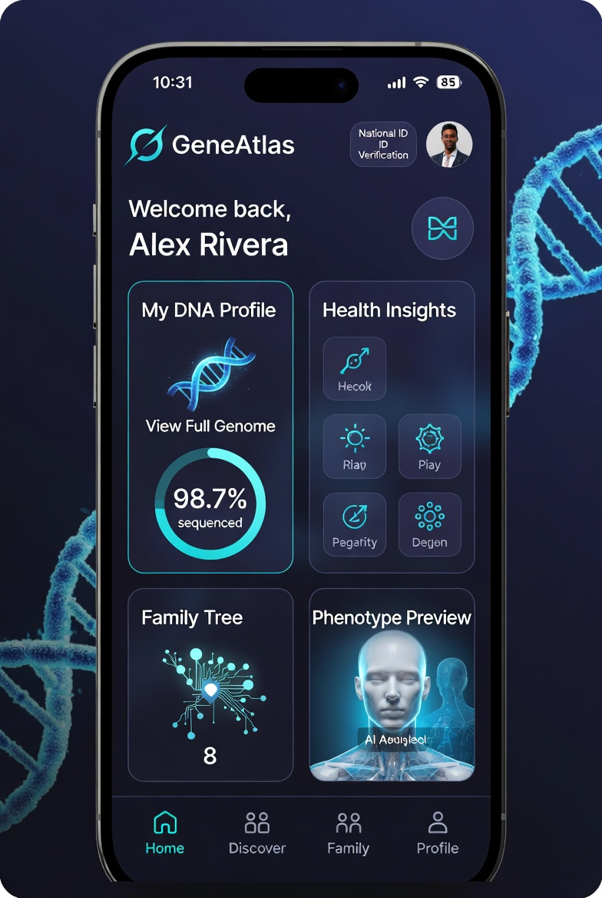
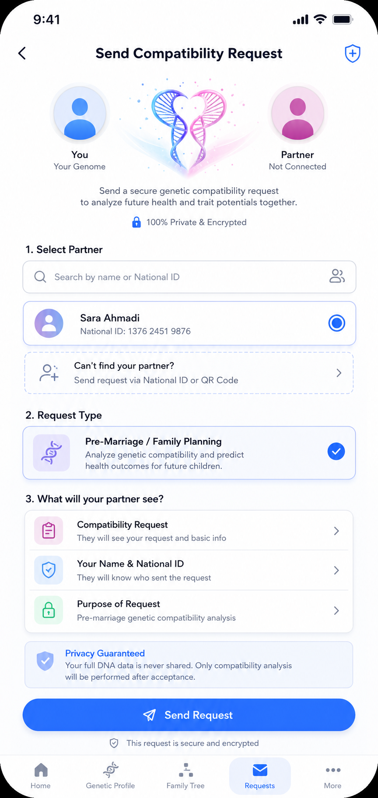
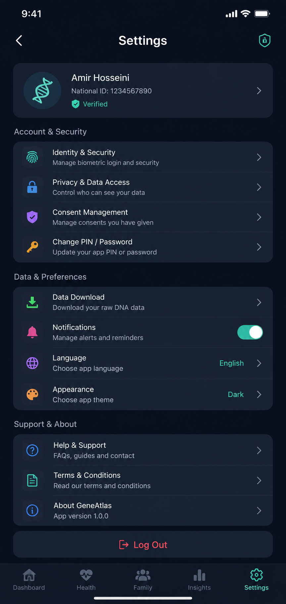
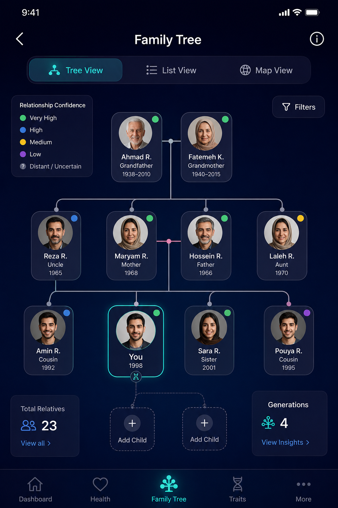
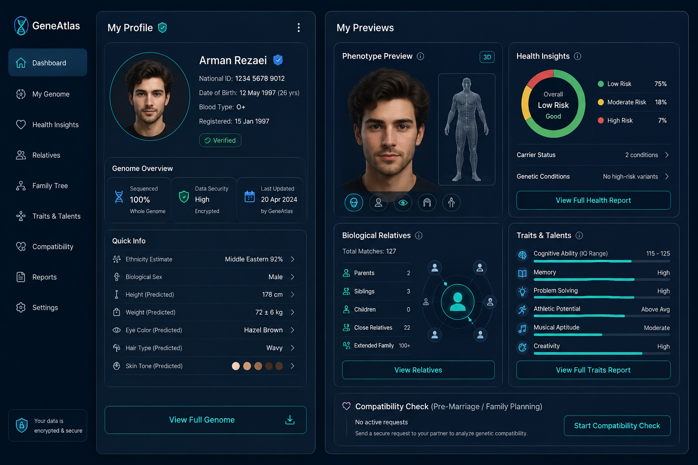
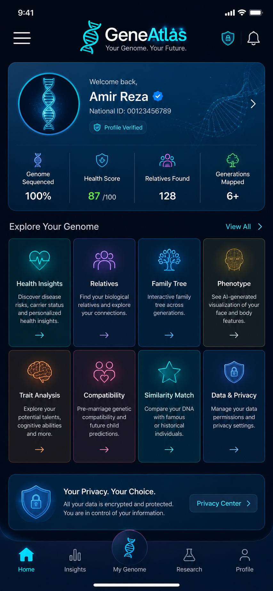

# GeneAtlas
https://90thetecafe.github.io/GeneAtlas/screenshots.html

# Description

> A research platform for synthetic genomic datasets, AI analysis, family relationship algorithms, phenotype prediction research, and privacy-preserving genomic computing.

## 📱 Application Screenshots

| Homepage | Requests | Settings | Family Tree |
|:---:|:---:|:---:|:---:|
|  |  |  |  |

| User Information | Features |
|:---:|:---:|
|  |  |

### **Executive Summary**

**GeneAtlas: National Genomic Intelligence Platform**

**Vision**  
GeneAtlas is a secure, government-controlled national (and potentially global) genomic platform designed to store citizens’ full DNA sequences and unlock transformative applications through advanced artificial intelligence and leverages advanced AI to deliver powerful insights for healthcare, family planning, scientific research, and human potential optimization.

It aims to become the foundational infrastructure for precision medicine, genomic understanding, and informed life decisions in the 21st century.

By creating a unified, privacy-first DNA registry, nations can move into the era of **precision medicine**, **proactive healthcare**, and **data-driven governance** while maintaining the highest standards of security and citizen consent.
 
---
 
Core Capabilities

* Phenotypic Reconstruction — Generate accurate 3D visualizations of face and body from DNA
* Relative Discovery & Family Tree — Automatic detection of biological relatives and dynamic interactive family trees
* Disease Risk Analysis — Comprehensive genetic illness prediction and carrier status reports
* Pre-Marriage Genetic Compatibility — Predict probable genetic outcomes and health risks for future children
* Genomic Research Engine — Large-scale AI training to decode gene functions, including intelligence, talents, personality traits, and other complex characteristics
* High-Potential Offspring Modeling — Simulate and explore genetic combinations associated with high IQ, exceptional talents, creativity, athletic ability, and other desirable traits
* Biological Sex & Trait Prediction — Accurate determination from genetic markers

---

**Core Concept**

A centralized, highly secure BioVault where:
- Governments securely register full genomic sequences of citizens (with explicit consent and strong legal safeguards)
- Individuals gain controlled access to their own genetic data
- Authorized AI systems deliver powerful insights and services

---

**Key Capabilities**

| Feature                        | Benefit |
|--------------------------------|-------|
| **Phenotypic Reconstruction**  | Generate accurate 3D face and body models from DNA |
| **Relative Discovery Engine**  | Automatically identify biological relatives |
| **Dynamic Family Tree**        | Real-time interactive pedigree and ancestry visualization |
| **Disease Risk Oracle**        | Advanced prediction of genetic illnesses and carrier status |
| **Biological Sex & Traits**    | Accurate determination from genetic markers |
| **AI Training Platform**       | Train specialized models on anonymized genomic data for research and healthcare innovation |

---

**Strategic Value for Governments**

- Informed family planning through genetic compatibility analysis before marriage
- **Healthcare Transformation**: Shift from reactive to predictive and preventive medicine
- Personalized health insights and preventive care
- Discovery of biological relatives and ancestry
- **Cost Savings**: Potentially save billions in healthcare expenditures through early intervention
- **National Security**: Advanced forensic capabilities and identity verification
- Significant reduction in hereditary diseases
- Stronger public health outcomes
- Leadership in genomic science and biotechnology
- Data-driven advancement of human capabilities
- **Scientific Leadership**: Position the country as a leader in genomics and AI
- Train powerful AI models to better understand the relationship between genes and complex traits (intelligence, talents, personality, etc.)
- Accelerate discovery of gene functions and biological mechanisms
- Enable large-scale research on human potential and genetic optimization
- **Economic Growth**: Create new industries in biotechnology, AI, and personalized medicine
- Drastically reduce genetic disorders through informed reproductive choices
- Unlock deeper scientific understanding of human genetics, including the genetic basis of intelligence and talent
- Enable a new era of personalized and preventive medicine
- Position the country as a global leader in genomic intelligence

---

**Projected Impact (by 2035)**

- Millions of lives extended through early disease detection
- Dramatic reduction in healthcare costs
- Accelerated drug discovery and personalized treatments
- Stronger national genomic sovereignty

---

**Implementation Approach**

GeneAtlas will operate under strict ethical guidelines, legal frameworks, and citizen consent mechanisms. All sensitive applications (such as family planning and trait prediction) will be voluntary, transparent, and subject to independent ethical oversight.

- **Phase 1**: Secure BioVault infrastructure + basic applications
- **Phase 2**: Advanced AI models and phenotype reconstruction
- **Phase 3**: Nationwide rollout with full integration
- **Governance**: Citizen-controlled data access + independent ethics oversight

---

**Call to Action**

GeneAtlas represents one of the most important infrastructure projects of the 21st century — the creation of a **National Genome Operating System**.

We are seeking visionary government partners, strategic investors, and leading research institutions to bring this platform from concept to reality.

---

# Features

## AI

* Train machine learning models on synthetic DNA
* Disease risk prediction research
* Population genetics analysis
* Variant classification
* Mutation detection
* Evolutionary analysis

## DNA Search

* Similar genome search
* Relative matching
* Ancestry clustering
* Population similarity
* DNA fingerprint comparison

## Family Tree

* Automatic pedigree generation
* Relationship detection
* Ancestor graph
* Descendant graph

## Health Research

* Genetic variant reports
* Carrier status research
* Polygenic risk score experiments
* Drug response prediction
* Rare mutation analysis

## Identity Research

* Biological sex prediction
* Mitochondrial haplogroup
* Y chromosome haplogroup
* Geographic ancestry estimation

## Visualization

* Genome browser
* Chromosome viewer
* Variant heatmaps
* Family tree visualization
* Population maps

## AI Research

* Transformer models for DNA
* DNA embeddings
* Gene expression prediction
* Protein prediction integration
* Genome language models

## Privacy

* Encryption
* Access control
* Audit logs
* Anonymous IDs
* Federated learning
* Differential privacy

# Structure

```text
GenomeAI/

├── backend/
├── frontend/
├── ai/
│   ├── models/
│   ├── training/
│   └── datasets/
├── dna/
├── family_tree/
├── disease_prediction/
├── visualization/
├── search/
├── authentication/
├── docs/
├── api/
├── tests/
└── README.md
```

# Future Research Ideas

* AI-generated genomic simulations
* Synthetic genome generation
* Cross-species genome comparison
* Personalized medicine research
* Drug target discovery
* Cancer mutation analysis
* Genome compression
* DNA language models
* Gene editing simulation
* Protein structure integration
