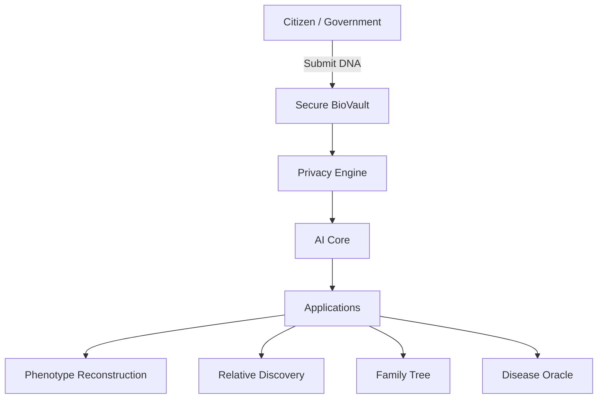

# GeneAtlas Architecture

## Overview

GeneAtlas is designed as a **secure, scalable, and privacy-first** genomic intelligence platform.

## Core Components

### 1. Secure BioVault (Data Layer)
- Encrypted genomic storage (CRISPR-level security)
- Zero-knowledge proof access control
- Blockchain-based audit trails
- Federated learning support

### 2. Privacy Engine
- Differential privacy
- Homomorphic encryption for computations
- Citizen-controlled data sharing keys
- Anonymization pipelines

### 3. AI Core (Intelligence Layer)
- Multimodal Foundation Model (DNA + Text + Image)
- Specialized models:
  - Phenotype Generator (GAN + Diffusion)
  - Polygenic Risk Scoring
  - Graph Neural Networks for genealogy
- Continuous learning from anonymized data

### 4. Application Layer
- Web Dashboard (`index.html` + React in future)
- Mobile App
- Research API
- Government Integration SDK

## Technology Stack

| Layer              | Technology                          |
|--------------------|-------------------------------------|
| Frontend           | HTML/Tailwind + React (future)      |
| Backend            | FastAPI / Node.js                   |
| Database           | PostgreSQL + Neo4j (graph)          |
| Storage            | IPFS + Encrypted Blob Storage       |
| AI/ML              | PyTorch, Hugging Face, ONNX         |
| Security           | WebAuthn, ZKP, TPM                  |
| Deployment         | Kubernetes + Confidential Computing |

## Data Flow

1. DNA sequenced → encrypted → stored in BioVault
2. User grants permission via cryptographic key
3. AI processes data in secure enclave
4. Results returned without exposing raw genome

## Security Principles

- **Privacy by Design**
- **Minimal Data Exposure**
- **User Sovereignty**
- **Auditable & Transparent**
- **Ethical AI Guidelines**

## Future Phases

**Phase 1 (2026)**: Static showcase + MVP Vault  
**Phase 2 (2027)**: AI Core + API  
**Phase 3 (2028+)**: Global Federation & Synthetic Biology

